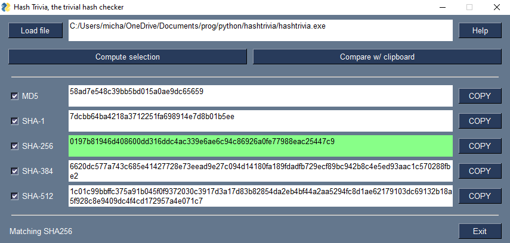

# Hash Trivia: the trivial hash checker

Hash Trivia is a small app to verify file integrity (a hash checker). At the 
moment functionality for MD5, SHA-1, and SHA-2 (SHA-256, SHA-384, SHA-512), is 
provided. 

## Installation

At the moment only an executable for Windows is provided. The executable named 
"hashtrivia.exe" is generated by pyinstaller and can be found in folder "dist".

## Usage (on a Windows platform)

The app computes hashes for a provided file. These hashes can be visually 
verified of hashes can be compared to a hash copied to the clipboard.

## Contributing

Pull requests are welcome. For major changes, please open an issue first
to discuss what you would like to change.

Please make sure to update tests as appropriate.

## License

TODO: license can be referred to by the following:
This project is licensed under the 
[Apache-2.0](https://choosealicense.com/licenses/apache-2.0/)
license, for convenience a copy is added within the root of the repository in the LICENSE.txt file.  

TODO: Within each file header the following may be added (suggestion only), I think it less distracting to have a license file in the code files themselves:
Copyright 2023 Michael Barbier

   Licensed under the Apache License, Version 2.0 (the "License");
   you may not use this file except in compliance with the License.
   You may obtain a copy of the License at

      http://www.apache.org/licenses/LICENSE-2.0

   Unless required by applicable law or agreed to in writing, software
   distributed under the License is distributed on an "AS IS" BASIS,
   WITHOUT WARRANTIES OR CONDITIONS OF ANY KIND, either express or implied.
   See the License for the specific language governing permissions and
   limitations under the License.
